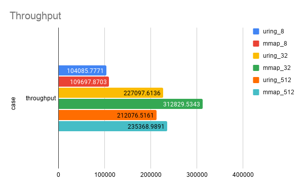

+++
title = "在 Rust 中实现基于 io_uring 的异步随机读文件"
date = 2021-01-30T17:37:23+08:00
toc = true
categories = ["Tech"]
+++

一句话总结：在 skyzh/uring-positioned-io 中，我包装了 Tokio 提供的底层 `io_uring` 接口，在 Rust 中实现了基于
`io_uring` 的异步随机读文件。你可以这么用它：

```rust
ctx.read(fid, offset, &mut buf).await?;
```

本文介绍了 `io_uring` 的基本使用方法，然后介绍了本人写的异步读文件库的实现方法，最后做了一个 benchmark，和 mmap 对比性能。

[点击这里可以访问 GitHub 项目][0]。

## io_uring 简介

`io_uring` 是一个由 Linux 内核的提供的异步 I/O 接口。它于 2019 年 5 月在 Linux 5.1 中面世，现在已经在各种项目中被使用。
比如：

* [RocksDB 的 MultiRead][1] 目前就是通过 `io_uring` 做并发读文件。
* Tokio 为 `io_uring` [包装了一层 API][2]。在 Tokio 1.0 发布之际，开发者表示今后会通过 io_uring 提供真正的异步文件操作
  (见 [Announcing Tokio 1.0][3])。
  目前 Tokio 的异步文件操作通过开另外的 I/O 线程调用同步 API 实现。
* QEMU 5.0 已经使用 `io_uring` (见 [ChangeLog][4])。

目前关于 `io_uring` 的测试，大多是和 Linux AIO 对比 Direct I/O 的性能 [(1)][5] [(2)][6] [(3)][7]。
`io_uring` 通常能达到两倍于 AIO 的性能。

## 随机读文件的场景

在数据库系统中，我们常常需要多线程读取文件任意位置的内容 `(<fid>, <offset>, <size>)`。
经常使用的 `read / write` API 无法完成这种功能（因为要先 seek，需要独占文件句柄）。
下面的方法可以实现文件随机读。

* 通过 `mmap` 直接把文件映射到内存中。读文件变成了直接读内存，可以在多个线程中并发读。
* `pread` 可以从某一位置 `offset` 开始读取 `count` 个字节，同样支持多线程并发读。

不过，这两种方案都会把当前线程阻塞住。比如 `mmap` 后读某块内存产生 page fault，当前线程就会阻塞；`pread` 本身就是一个阻塞的 API。
异步 API (比如 Linux AIO / `io_uring`) 可以减少上下文切换，从而在某些场景下提升吞吐量。

## io_uring 的基本用法

`io_uring` 相关的 syscall 可以在 [这里][8] 找到。[liburing][9] 提供了更易用的 API。
Tokio 的 [io_uring crate][10] 在此基础之上，提供了 Rust 语言的 `io_uring` API。下面以它为例，
介绍 `io_uring` 的使用方法。

要使用 `io_uring`，需要先创建一个 ring。在这里我们使用了 `tokio-rs/io-uring` 提供的 `concurrent` API，
支持多线程使用同一个 ring。

```rust
use io_uring::IoUring;
let ring = IoUring::new(256)?;
let ring = ring.concurrent();
```

每一个 ring 都对应一个提交队列和一个完成队列，这里设置队列最多容纳 256 个元素。

通过 `io_uring` 进行 I/O 操作的过程分为三步：往提交队列添加任务，向内核提交任务 [注1]，
从完成队列中取回任务。这里以读文件为例介绍整个过程。

通过 `opcode::Read` 可以构造一个读文件任务，通过 `ring.submission().push(entry)` 可以将任务添加到队列中。

```rust
use io_uring::{opcode, types::Fixed};
let read_op = opcode::Read::new(Fixed(fid), ptr, len).offset(offset);
let entry = read_op
            .build()
            .user_data(user_data);
unsafe { ring.submission().push(entry)?; }
```

任务添加完成后，将它提交到内核。

```rust
assert_eq!(ring.submit()?, 1);
```

最后轮询已经完成的任务。

```rust
loop {
    if let Some(entry) = ring.completion().pop() {
        // do something
    }
}
```

这样一来，我们就实现了基于 `io_uring` 的随机读文件。

注 1: `io_uring` 目前有三种执行模式：默认模式、poll 模式和内核 poll 模式。如果使用内核 poll 模式，则不一定需要调用提交任务的函数。

## 利用 io_uring 实现异步读文件接口

我们的目标是实现类似这样的接口，把 `io_uring` 包装起来，仅暴露给开发者一个简单的 `read` 函数。

```rust
ctx.read(fid, offset, &mut buf).await?;
```

参考了 [tokio-linux-aio][11] 对 Linux AIO 的异步包装后，我采用下面方法来实现基于 `io_uring` 的异步读。

* 开发者在使用 `io_uring` 之前，需要创建一个 `UringContext`。
* `UringContext` 被创建的同时，会在后台运行一个（或多个）用来提交任务和轮询完成任务的 `UringPollFuture`。
  (对应上一章节中读文件的第二步、第三步操作)。
* 开发者可以从 `ctx` 调用读文件的接口，用 `ctx.read` 创建一个 `UringReadFuture`。在调用 `ctx.read.await` 后：
    1. `UringReadFuture` 会创建一个固定在内存中的对象 `UringTask`，然后把读文件任务放进队列里，将 `UringTask` 的地址作为
        读操作的用户数据。`UringTask` 里面有个 channel。
    2. `UringPollFuture` 在后台提交任务。
    3. `UringPollFuture` 在后台轮询已经完成的任务。
    4. `UringPollFuture` 取出其中的用户数据，还原成 `UringTask` 对象，通过 channel 通知 `UringReadFuture`
        I/O 操作已经完成。

整个流程如下图所示。


这样，我们就可以方便地调用 `io_uring` 实现文件的异步读取。这么做还顺便带来了一个好处：任务提交可以自动 batching。
通常来说，一次 I/O 操作会产生一次 syscall。但由于我们使用一个单独的 Future 来提交、轮询任务，在提交的时候，
队列里可能存在多个未提交的任务，可以一次全部提交。这样可以减小 syscall 切上下文的开销 (当然也增大了 latency)。
从 benchmark 的结果观察来看，每次提交都可以打包 20 个左右的读取任务。

## Benchmark

将包装后的 `io_uring` 和 `mmap` 的性能作对比。测试的负载是 128 个 1G 文件，随机读对齐的 4K block。
我的电脑内存是 32G，有一块 1T 的 NVMe SSD。测试了下面 6 个 case：

* 8 线程 mmap。 (mmap_8)
* 32 线程 mmap。 (mmap_32)
* 512 线程 mmap。 (mmap_512)
* 8 线程 8 并发的 `io_uring`。(uring_8)
* 8 线程 32 并发的 `io_uring`。即 8 个 worker thread, 32 个 future 同时 read。(uring_32)
* 8 线程 512 并发的 `io_uring`。(uring_512)

测试了 Throughput (op/s) 和 Latency (ns)。

| case | throughput | p50 | p90 | p999 | p9999 | max |
| ---- | ---- | ---- | ---- | ---- | ---- | ---- |
| uring_8 | 104085.77710777053 | 83166 | 109183 | 246416 | 3105883 | 14973666 |
| uring_32 | 227097.61356918357 | 142869 | 212730 |  1111491 | 3321889 | 14336132 |
| uring_512 | 212076.5160505447 | 1973421 | 3521119 | 19478348 | 25551700 | 35433481 |
| mmap_8 | 109697.87025744558 | 78971 | 107021 | 204211 | 1787823 | 18522047 |
| mmap_32 | 312829.53428971884 | 100336 | 178914 | 419955 | 4408214 | 55129932 |
| mmap_512 | 235368.9890904751 | 2556429 | 3265266 | 15946744 | 50029659 | 156095218 |

发现 mmap 吊打 `io_uring`。嗯，果然这个包装做的不太行，但是勉强能用。下面是一分钟 latency 的 heatmap。每一组数据的展示顺序是先 mmap 后 `io_uring`。

**mmap_8 / uring_8**


**mmap_32 / uring_32**


**mmap_512 / uring_512**





## 一些可能的改进

* 看起来现在 `io_uring` 在我和 Tokio 的包装后性能不太行。之后可以通过对比 Rust / C 在 `io_uring` nop
  指令上的表现来测试 Tokio 这层包装引入的开销。
* 测试 Direct I/O 的性能。目前只测试了 Buffered I/O。
* 和 Linux AIO 对比。（性能不会比 Linux AIO 还差吧（痛哭
* 用 perf 看看现在的瓶颈在哪里。目前 `cargo flamegraph` 挂上去以后 `io_uring` 没法申请内存。（占个坑，说不定能出续集
* 目前，用户必须保证 `&mut buf` 在整个 read 周期都有效。如果 Future 被 abort，会有内存泄漏的问题。
  futures-rs 的类似问题见 https://github.com/rust-lang/futures-rs/issues/1278 。Tokio 目前的
  I/O 通过两次拷贝（先到缓存，再给用户）解决了这个问题。
* 或许可以把写文件和其他操作也顺便包装一下。

[0]: https://github.com/skyzh/uring-positioned-io
[1]: https://github.com/facebook/rocksdb/pull/5881
[2]: https://github.com/tokio-rs/io-uring
[3]: https://tokio.rs/blog/2020-12-tokio-1-0
[4]: https://wiki.qemu.org/ChangeLog/5.0
[5]: https://thenewstack.io/how-io_uring-and-ebpf-will-revolutionize-programming-in-linux/
[6]: https://developers.mattermost.com/blog/hands-on-iouring-go/
[7]: https://zhuanlan.zhihu.com/p/62682475
[8]: https://kernel.dk/io_uring.pdf
[9]: https://github.com/axboe/liburing
[10]: https://github.com/tokio-rs/io-uring
[11]: https://github.com/hmwill/tokio-linux-aio
