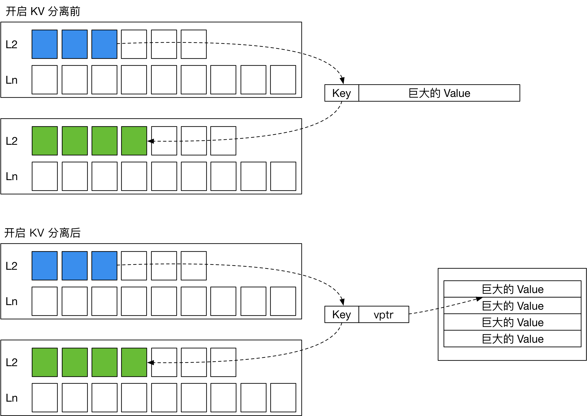

+++
title = "LSM 存储引擎中 KV 分离的实现"
date = "2021-08-07T12:00:00+08:00"
toc = true
+++

常见的 LSM 存储引擎，如 LevelDB 和 RocksDB，将用户写入的一组的 key 和 value 存放在一起，按顺序写入 SST。在 compaction 过程中，引擎将上层的 SST 与下层 SST 合并，产生新的 SST 文件。这一过程中，SST 里面的 key 和 value 都会被重写一遍，带来较大的写放大。如果 value 的大小远大于 key，compaction 过程带来的写放大会引入巨大的开销。

在 WiscKey (FAST '16) 中，作者提出了一种对 SSD 友好的基于 LSM 树的存储引擎设计。它通过 KV 分离降低了 LSM 树的写放大。
KV 分离就是将大 value 存放在其他地方，并在 LSM 树中存放一个 value pointer (vptr) 指向 value 所在的位置。在 WiscKey 中，这个存放 value 的地方被称为 Value Log (vLog)。由此，LSM 树 compaction 时就不需要重写 value，仅需重新组织 key 的索引。这样一来，就能大大减少写放大，减缓 SSD 的磨损。

KV 分离的思路听起来非常简单，但在实际实现时，还需要考虑许多问题：
* vLog 的内容应该如何组织？如何对 vLog 做压缩？
* 用户删除 value 后，如何回收 vLog 中的垃圾？
* 回收垃圾时，如何更新 LSM 树中的 vptr？
* 如何解决 KV 分离带来的 scan 性能影响？
* ……

如今，距离 WiscKey 这篇论文的发布已经过去了五年的时间。工业界中也陆续涌现出了一批 KV 分离的 LSM 存储引擎实现。在这篇文章中，我将介绍三个开源的 KV 分离存储引擎实现，对比它们的不同，从而引出 KV 分离实现过程中的 tradeoff，给读者更多关于大 value 场景下 KV 分离存储引擎选型的启发。

* [BadgerDB](https://github.com/dgraph-io/badger) 是最接近 WiscKey 论文所述的 KV 分离存储引擎。BadgerDB 是 Dgraph 图数据库的存储引擎，使用大道至简 Go 语言编写。
* [TerarkDB](https://github.com/bytedance/terarkdb) 是由 Terark (现已被字节跳动收购) 开发的存储引擎，基于 RocksDB 5.x 开发。TerarkDB 目前已经在字节跳动内部投入使用。
* [Titan](https://github.com/tikv/titan) 是作为 RocksDB 插件提供的存储引擎，兼容 RocksDB 6.x 的所有接口，由 PingCAP 主导开发。Titan 目前已经可以在 TiKV 中使用。

## 写入流程与数据存储 

TerarkDB + Titan: Blob File, 有序
Badger / AgateDB: vLog, 乱序
BlobDB

压缩粒度，写入流程

kv 分离阈值选择 256 / 4096

读流程，读放大？

## 垃圾回收的实现

Scan 性能，写放大

索引一致性

MVCC，WriteCallback，on-demand

## 读流程的开销与分析

## 总结
