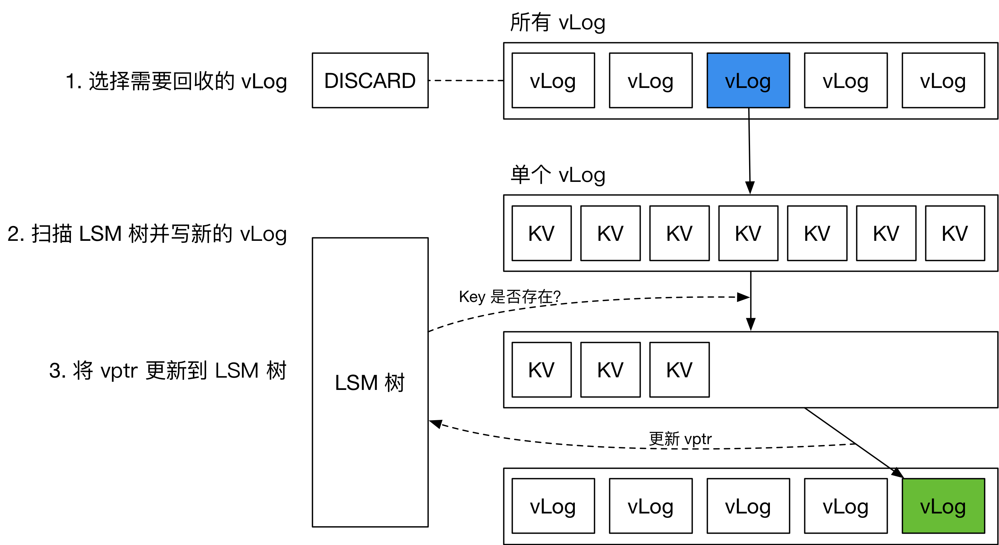
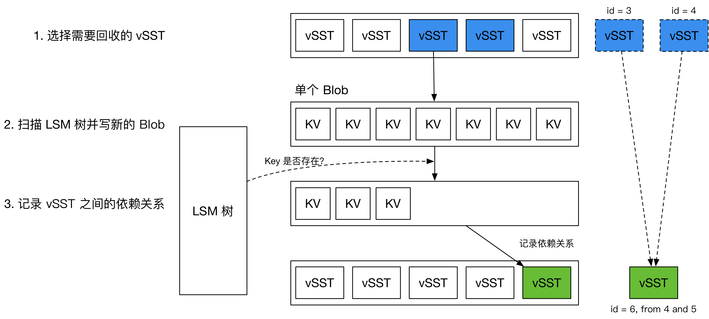
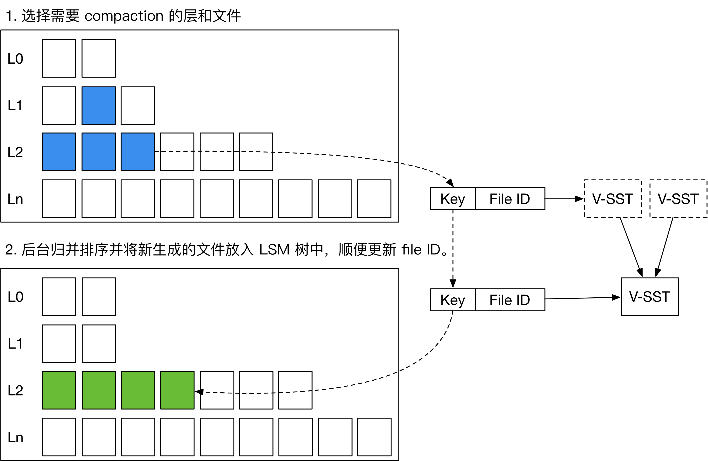
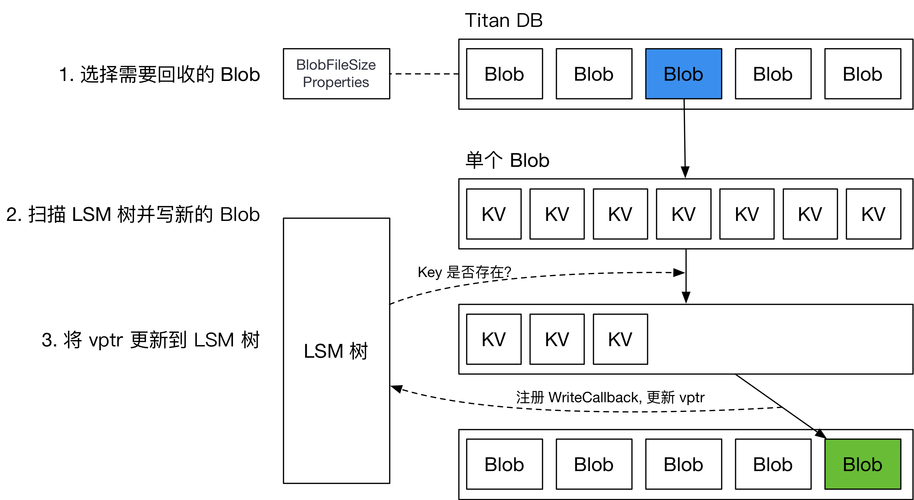
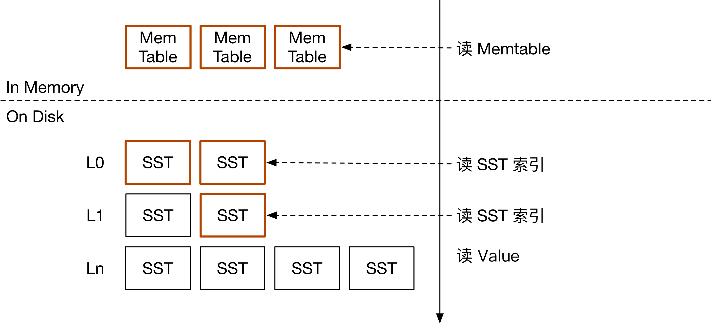
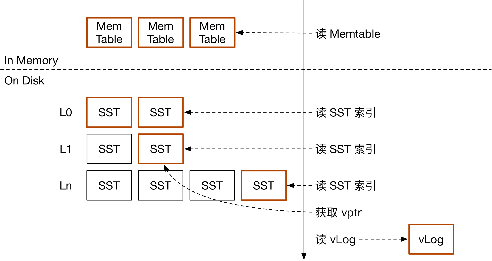
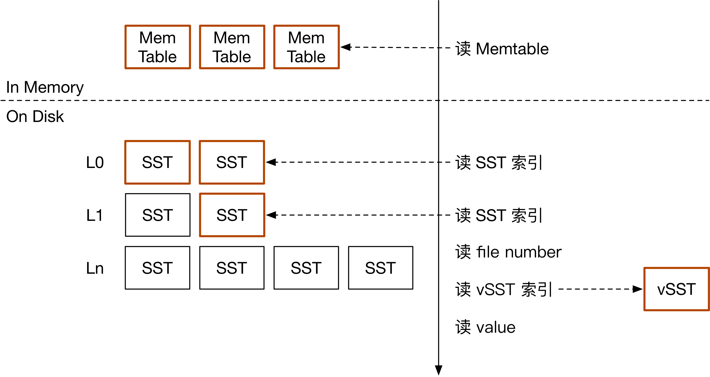
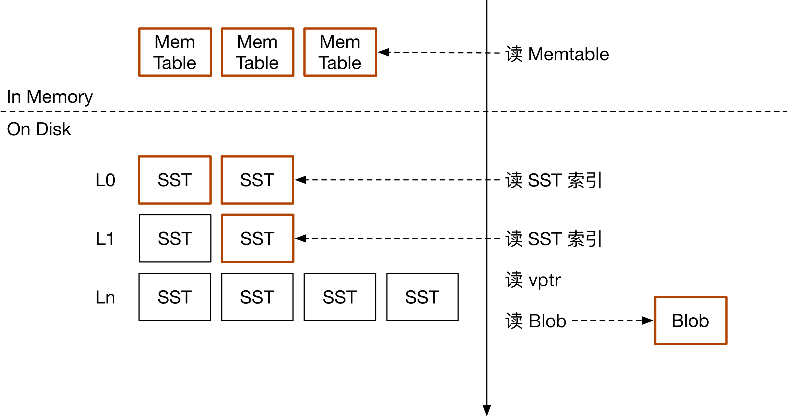

+++
title = "LSM 存储引擎中 KV 分离的实现"
date = "2021-08-07T12:00:00+08:00"
toc = true
+++

常见的 LSM 存储引擎，如 LevelDB 和 RocksDB，将用户写入的一组的 key 和 value 存放在一起，按顺序写入 SST。在 compaction 过程中，引擎将上层的 SST 与下层 SST 合并，产生新的 SST 文件。这一过程中，SST 里面的 key 和 value 都会被重写一遍，带来较大的写放大。如果 value 的大小远大于 key，compaction 过程带来的写放大会引入巨大的开销。

在 [WiscKey (FAST '16)](https://www.usenix.org/conference/fast16/technical-sessions/presentation/lu) 中，作者提出了一种对 SSD 友好的基于 LSM 树的存储引擎设计。它通过 KV 分离降低了 LSM 树的写放大。
KV 分离就是将大 value 存放在其他地方，并在 LSM 树中存放一个 value pointer (vptr) 指向 value 所在的位置。在 WiscKey 中，这个存放 value 的地方被称为 Value Log (vLog)。由此，LSM 树 compaction 时就不需要重写 value，仅需重新组织 key 的索引。这样一来，就能大大减少写放大，减缓 SSD 的磨损。

KV 分离的思路听起来非常简单，但在实际实现时，还需要考虑许多问题：
* vLog 的内容应该如何组织？如何对 vLog 做压缩？
* 用户删除 value 后，如何回收 vLog 中的垃圾？
* 回收垃圾时，如何更新 LSM 树中的 vptr？
* 如何解决 KV 分离带来的 scan 性能影响？
* ……

如今，距离 WiscKey 这篇论文的发布已经过去了五年的时间。工业界中也陆续涌现出了一批 KV 分离的 LSM 存储引擎实现。在这篇文章中，我将介绍三个开源的 KV 分离存储引擎实现，对比它们的不同，从而引出 KV 分离实现过程中的 tradeoff，给读者更多关于大 value 场景下 KV 分离存储引擎选型的启发。

* [BadgerDB](https://github.com/dgraph-io/badger) 是最接近 WiscKey 论文所述的 KV 分离存储引擎。BadgerDB 是 Dgraph 图数据库的存储引擎，使用大道至简 Go 语言编写。
* [TerarkDB](https://github.com/bytedance/terarkdb) 是由 Terark (现已被字节跳动收购) 开发的存储引擎，基于 RocksDB 5.x 开发。TerarkDB 目前已经在字节跳动内部投入使用。
* [Titan](https://github.com/tikv/titan) 是作为 RocksDB 插件提供的存储引擎，兼容 RocksDB 6.x 的所有接口，由 PingCAP 主导开发。Titan 目前已经可以在 TiKV 中使用。

## 写入流程与数据存储 

在本文中，如无特殊说明，我们都假设存储引擎开启 WAL，且 LSM 树使用 Leveled Compaction。

### 常见 LSM 存储引擎的写流程

首先，我们来看看常见的 LSM 存储引擎是如何处理写入请求的。接收到用户的写入请求后，引擎会将这对 key-value 直接写入 Memtable 和 WAL。Memtable 大多采用跳表存储 KV 对。WAL 用于持久化，以便服务器掉电后恢复 Memtable 的信息。自此，即可通知用户写入操作已经持久化。

LSM 引擎的后台操作主要包括两个任务：将 Memtable 刷到盘上 (Flush)，以及对 LSM 树做 compaction。内存中同一时间只有一个正在写入的 Memtable，其他 Memtable 都是不可变的。当内存中 Memtable 超过限制后，引擎会将 Memtable 的内容转换为 SST 刷到盘上，并删除 WAL。SST 就是有序存储 KV 对的文件。SST 中的数据分块存储，按块压缩。在写入 KV 对的内容后，SST 的末尾是若干个索引块，记录每个数据块开头的 key，以便快速定位 key 的位置。SST 中可能含有 Bloom Filter 等结构加速查询。

LSM 树的第 0 层包含多个 SST，SST 的 key 范围可能互相重叠。从 L1 层开始，同一层的 SST key 范围就互不重叠。SST 进入 LSM 树后，会对超过容量限制的层做 compaction。由此，用户写入的 key 和 value 将随着时间的推移逐渐移动到引擎的最下层。

当 LSM 树初始为空时，SST 文件如果从 L0 层一层层 compaction 到最后一层，会引入一些不必要的写放大。因此，大多数 LSM 存储引擎都提供了 compaction-to-Lbase 的功能。在这种情况下，每一层可以容纳的 SST 文件大小都是动态可调的。SST 可能直接从 L0 层刷到 L6 层，从而减少 LSM 树刚开始灌数据时的写放大。

### BadgerDB 的写流程

在 BadgerDB 中，大 value 在用户请求写入时就会直接落入 vLog 中。整个流程如下图所示。

用户请求向 Badger 中写入 KV 对，如果 value 小于阈值，那么整个流程和常见的 LSM 引擎一样。如果 value 大于等于阈值，整个写入流程如下：
* 大 value 首先会被追加到 vLog 中。BadgerDB 中只有一个活跃的 vLog。当一个 vLog 超过设定的大小后，引擎会新建一个文件作为新的 vLog。因此，Badger 使用多个 vLog 文件存储用户写入的大 value。每个 vLog 文件按写入顺序存储用户的大 value 和对应的 key。
* 写入 vLog 后，即可获得该 value 在 vLog 的位置，和 vLog 的编号。BadgerDB 将 `<key, <fileno, offset>>` 作为 KV 对写入 WAL, Memtable 和 LSM 树中，这个流程和常见 LSM 引擎一致。

### TerarkDB 的写流程

由于 TerarkDB 基于 RocksDB 开发，整个写流程在前台阶段和 RocksDB 一致。KV 对被写入 Memtable 和 WAL，然后在引擎后台将 Memtable 刷盘。相对于 Badger 来讲，value 需要在前台被写入 WAL，并且在 Flush 时被写入 v-SST (Value SST)。这个过程引入了额外的一倍写放大。

后台刷盘时，TerarkDB 将 Memtable 根据 value 大小拆分。小 value 和 key 一起打包进 SST，和常见 LSM 引擎一致。大 value 和对应的 key 会被写入 v-SST 中，以 SST 的形式存储。由于 SST 中包含索引块，在查询时可以仅根据 key 迅速定位到 value 的位置，在 LSM 树中，TerarkDB 仅存储大 value 对应的 key，和 value 所在的文件编号，即 `<key, fileno>`，不存储大 value 的 offset。

由于大 value 以 SST 形式存储，TerarkDB 的 大 value 在单 v-SST 中是按 key 排序的。与此同时，借助 RocksDB 已有的工具，TerarkDB 可以对 v-SST 做块级别压缩。在这种情况下，TerarkDB 的默认 KV 分离阈值通常设置的比较小，在 512B 左右。而 BadgerDB 则把这个默认值设置为 4K。

### Titan 的写流程

Titan 是 RocksDB 的一个插件，所以整体的前台流程和 RocksDB 几乎一样。后台流程和 TerarkDB 相近，唯一的区别是存储大 value 的方式。Titan 通过特殊的格式 BlobFile 存储大 value。BlobFile 中包含了有序存储的 KV 对，KV 对按单个记录压缩。因此，在 Flush 的过程中，大 value 在 LSM 树中的存储形式为 `<key, <fileno, offset>>`。

### 写流程对比

| 存储引擎                       | BadgerDB           | TerarkDB                    | Titan                          |
| ------------------------------ | ------------------ | --------------------------- | ------------------------------ |
| 大 value 前台写入 (影响写放大) | 直接进 vLog        | 进 WAL, 而后 Flush 到 v-SST | 进 WAL, 而后 Flush 到 BlobFile |
| vptr 内容                      | `<fileno, offset>` | `fileno`                    | `<fileno, offset>`             |
| vLog 排序  (影响 Scan 性能)    | 按写入顺序         | 按 key 排序                 | 按 key 排序                    |
| vLog 压缩粒度 (影响空间放大)   | Per-Record         | Per-Block                   | Per-Record                     |
| vLog 是否包含索引              | 否                 | 是                          | 否                             |
| 默认 KV 分离阈值               | 4K                 | 512B                        | 4K                             |

## 垃圾回收的实现

在用户删除或更新 key 后，常见 LSM 引擎会在 compaction 过程中把旧的记录删除，如下图所示：如果在做 compaction 时，发现上下层有相同的 key，或者上层有 delete tombstone，引擎则会将下层的 key 删除，在新生成的 SST 中只保留一份 KV。

将大 value 分离出 LSM 树后，我们需要处理大 value 的垃圾回收，减少盘上存在的垃圾数据，减少 KV 分离导致的空间放大。

### BadgerDB 的垃圾回收

如上图所示，BadgerDB 将每个 vLog 的垃圾估算值存放在 `DISCARD` 文件中。当用户更新或删除某个 key 时，对应 vLog 文件的计数器就会加 1。当计数器到达某个阈值时，这个 vLog 就会被重写。

BadgerDB 在重写 vLog 过程中，会扫描当前处理的 key 在 LSM 树中是否存在。若不存在或已更新，则忽略这个 key。

当新的 vLog 生成完成后，BadgerDB 会将这些 KV 的新位置写回到 LSM 树中。因此，BadgerDB 的 GC 过程会对 LSM 树的用户写入吞吐量造成影响。这里就会产生一个问题：如果用户已经删除了一个 key，但 GC 时把这个 key 对应的旧 value 写回了 LSM 树，是否会在读取时造成正确性问题？

如上图所示，BadgerDB 的内部存储的 key 是 key + timestamp 的组合。在回写 LSM 树时，BadgerDB 无需考虑当前 key 是否已经被用户删除或更新。这样确实会导致用户新写入的 value (对应的 key-vptr) 反而在旧 value (对应的 key-vptr) 之下，不过 Badger 在读取时会扫描所有层，由此解决了这个可能存在的正确性问题。在后面的读流程中，我也会介绍这一点。

### TerarkDB 的 Compaction 与垃圾回收

在 TerarkDB 中，v-SST 的 GC 不需要回写 LSM 树，由此降低了 GC 对用户前台流量的影响。

如上图所示，TerarkDB 在后台会根据 v-SST 的垃圾量选择需要 GC 的 v-SST。GC 过程会遍历每个 key，确认它们在 LSM 树中是否被删除或更新。GC 后会产生新的 v-SST。TerarkDB 在 MANIFEST 中记录 v-SST 之间的依赖关系。如果用户访问的 key 指向了一个旧的 v-SST，TerarkDB 根据依赖关系找到最新的 v-SST，并读取其中的 value。总的来说，TerarkDB 特别的地方在于垃圾回收不会影响前台的写流量。

TerarkDB 在 LSM 树 compaction 的过程中顺便将每个大 value 所在的文件编号更新到最新。如上图所示，引擎如果在 compaction 过程中发现某个大 value 对应的文件已经被删除，则根据依赖关系将新的文件编号写入 compaction 生成的 SST 中。

在实际生产环境中，这种 GC 方式可能导致 LSM 树最下层的 SST 依赖几乎所有 v-SST，同时某一个 v-SST 被许多 SST 引用，造成性能上的损失。TerarkDB 会对这种包含错综复杂依赖关系的 SST 进行一种特殊的 compaction，名叫“rebuild”。在 rebuild 过程中，引擎会尽量简化依赖链，保证系统的正常运行。

### Titan 的垃圾回收

Titan 的普通垃圾回收 (Regular GC) 采用了和 BadgerDB 类似的策略，用统计信息确定要回收的 BlobFile，而后重写对应的 BlobFile，将新的 vptr 写回 LSM 树。整个流程如下图所示。

由于 Titan 没有类似 Badger 的内置 MVCC 功能，在回写 LSM 树时，需要注册 WriteCallback，在 callback 中检测当前回写的 key 是否已经被删除或更新。这会对引擎 GC 过程中的用户写入吞吐造成巨大的影响。

为了解决这一问题，Titan 引入了一种新的 GC 方案，名为“Level Merge”，如下图所示，在 LSM 树做 compaction 的过程中，Titan 会将对应的 BlobFile 重写，并顺便更新 SST 中的 vptr。由此减少了对前台用户写入的影响。

Titan 的 Level Merge 仅在 LSM 树的最后两层启用。

### GC 流程对比

| 存储引擎        | BadgerDB            | TerarkDB             | Titan                                |
| --------------- | ------------------- | -------------------- | ------------------------------------ |
| vLog GC 任务    | 重写 vLog，回写 LSM | 合并 v-SST + Rebuild | 合并 BlobFile，回写 LSM (Regular GC) |
| Compaction 任务 | 无                  | 更新文件编号到最新   | 重写 BlobFile (Level Merge)          |

## 大 value 读流程的开销与分析

如下图所示。在常见的 LSM 存储引擎中，读单个 key 需要遍历 Memtable，L0 SST，以及之后每一层的其中一个 SST。在碰到相同的 key 后，即可把结果返回给用户。

在 KV 分离的场景下，读流程和常见 LSM 树有所不同。

### BadgerDB 的读流程

如上图所示，BadgerDB 由于存在新写入数据在旧写入数据下层的问题，每次读取都要击穿所有层。遍历 Memtable + L0 + 每一层的其中一个 SST 后，即可根据 vptr 访问 vLog 获取 value。

在 scan 的过程中，由于 vLog 中按写入顺序存放 value，顺序 scan 极有可能变成 vLog 上的随机读。为了避免 scan 的性能下降，BadgerDB 会在用户通过迭代器访问下一个 value 之前就从盘上提前获取下一个 value 的值。由此有效利用 SSD 的带宽，改善 scan 的性能。

### TerarkDB 的读流程

如上图所示，TerarkDB 首先要从 LSM 树中找到 key 对应的 v-SST 文件。而后，根据依赖关系访问最新的 v-SST，在 v-SST 的索引中找到对应的 key，而后访问 value。

### Titan 的读流程

Titan 读取时需要从 LSM 树中找到 vptr，然后访问对应的 BlobFile。

### 读流程对比

| 存储引擎  | BadgerDB          | TerarkDB            | Titan              |
| --------- | ----------------- | ------------------- | ------------------ |
| Scan 性能 | 差，需要 prefetch | 好                  | 好                 |
| 点读 key  | 需要访问所有层    | 遇到第一个即可停止  | 遇到第一个即可停止 |
| 读 value  | offset 直接读取   | 需要访问 v-SST 索引 | offset 直接读取    |
| MVCC      | 支持              | 内部 Sequence No.   | 内部 Sequence No.  |

## 总结

LSM 树的 KV 分离可以减小存储引擎的写放大。但与此同时，它也带来了其他地方的开销，比如空间放大、影响前台写性能、影响压缩率、增长读路径、需要击穿读等等。此时，就需要用户根据业务负载选择合适的 KV 分离引擎，赋能业务，打通闭环，有效利用硬件资源。

## Reference

* [WiscKey: Separating Keys from Values in SSD-conscious Storage](https://www.usenix.org/conference/fast16/technical-sessions/presentation/lu)
* [dgraph-io/badger: Fast key-value DB in Go.](https://github.com/dgraph-io/badger)
* [Introducing Badger: A fast key-value store written purely in Go](https://blog.dgraph.io/post/badger/)
* [bytedance/terarkdb: A RocksDB compatible KV storage engine with better performance](https://github.com/bytedance/terarkdb)
* [TerarkDB All-In-One Docs](https://bytedance.feishu.cn/docs/doccnZmYFqHBm06BbvYgjsHHcKc#)
* [tikv/titan: A RocksDB plugin for key-value separation, inspired by WiscKey](https://github.com/tikv/titan/tree/master)
* [Titan 的设计与实现](https://pingcap.com/blog-cn/titan-design-and-implementation/)

欢迎在这篇文章对应的 [Pull Request](https://github.com/skyzh/skyzh.github.io/pull/5) 下使用 GitHub 账号评论、交流你的想法。
