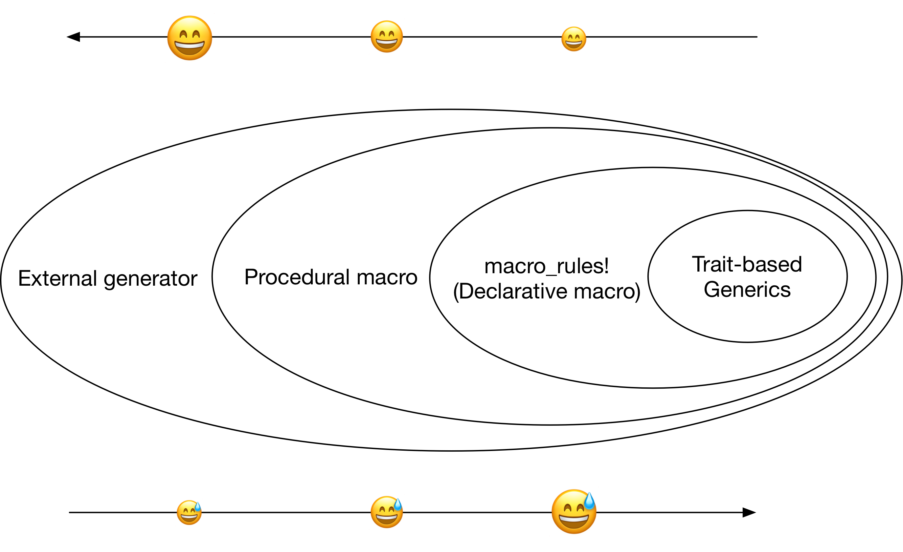

+++
title = "用 Rust 做类型体操 (上篇)"
date = "2022-01-22T16:00:00+08:00"
toc = true
tags = ["Rust", "数据库", "执行器", "类型", "GAT"]
+++

TL;DR: 本人前两天刚写的 [type-exercise-in-rust (GitHub)](https://github.com/skyzh/type-exercise-in-rust) 中已经包含了一整套数据库执行器的类型设计，本文将详细介绍整个设计过程中的思考过程和解决方案。

通常来说，在 Rust 语言中可以使用 trait 来做泛型 (generics)。但由于语言的一些限制，开发者往往难以用编程语言表达自己所需的 trait。在这种背景下，开发者往往会诉诸其他工具。举个例子：

```rust
// 正常来说，开发者可以用 trait 来定义共享行为，从而实现 generics
pub fn speak(animal: impl Animal) {
  println!("Hi, I'm {}", animal.identity());
}

// 由于某些原因，开发者没法给 Animal 实现 `identity`。因此，只能通过类似
// macro 的工具来生成重复代码。
pub fn speak(animal: AnimalEnum) {
  generate_match_arms! { animal, identity_map }
}

// 由于某些原因，Rust 的 macro_rules 无法表达开发者所需的泛型，开发者
// 可能会选择 procedural macro 来从 AST-level 生成代码
#[generate_speak]
pub fn speak(animal: AnimalEnum) {
  // 里面的内容会被过程宏替换掉
  todo!()
}

// 最终，开发者发现不管怎么样都没法使用 Rust 语言表达所需的泛型，选择使
// 用外部工具生成代码。
pub fn generate_code() -> Result<()> {
  std::fs::write("animal.rs", format!("
  pub fn speak(animal: AnimalEnum) {{
    {generated_code}
  }}
  ", generated_code = generate_code_for_animal()))
}
```

从方法论的角度来讲，一旦开发者在某个需要使用泛型的地方使用了宏展开，调用它的代码就不可能再通过 trait-based generics 使用这段代码。从这个角度来说，越是“大道至简”的生成代码，越难维护。但反过来说，如果要完全实现 trait-based generics，往往要和编译器斗智斗勇，就算是通过编译也需要花掉大量的时间。



取得可维护性和易用性的平衡是一件困难的事情。不过在数据库系统的场景里，我们更愿意做到“一劳永逸”——数据库执行器所支持的数据类型是有限的，这一块代码往往写完之后就不会有大的改动了。为了使用这一套系统的开发者写代码写得快乐，在执行器的数据类型里做一些“类型体操”是比较合适的事情。

《用 Rust 做类型体操》系列以构造一个数据库执行器的数据类型框架为例，带开发者了解如何使用 Rust 语言的黑魔法，在 safe nightly Rust 中实现各种神奇的泛型操作，在编译期用最少的代码量生成尽可能多的调用组合，减少运行时开销。

## 设计目标


如上图所示，《用 Rust 做类型体操》系列围绕 `Array` 构造了一整套 trait 系统，从而帮助开发者更好地在这套系统上实现想要的功能。举一些例子：

**统一零开销接口**

在我们的实现中，`Array` 是一个存储数据集合的数据结构。`Array` 可能实现了一些比较特殊的内存布局，导致无法取得所有权类型的引用。举例：

* 从 `Vec<String>` 中，可以零拷贝地取得 `&String`.
* 如果使用类似 Apache Arrow 的方式存储 `StringArray` (offset + flat array), 则只能取得 `&str`。

我们实现的这套 `Array` 抽象可以很好地表示 Array 存储的所有权类型 `String` 和 Array 可以获得的引用类型 `&str` 之间的关系。这一套接口既可以给定长类型用，也可以给变长类型用。

**表达式向量化**

开发者只需要实现处理单个数据的 SQL 函数，我们的框架可以直接将它展开为向量化后的函数。

```rust
pub struct ExprStrContains;

impl BinaryExprFunc<StringArray, StringArray, BoolArray> for ExprStrContains {
    fn eval(&self, i1: &str, i2: &str) -> bool {
        i1.contains(i2)
    }
}

#[test]
fn test_str_contains() {
    // 编译期将 StrContains 函数向量化
    let expr = build_binary_expression(
        ExpressionFunc::StrContains,
        DataType::Varchar,
        DataType::Char { width: 10 },
    );

    let i1: ArrayImpl = StringArray::from_slice(&[Some("000"), Some("111"), None]).into();
    let i2: ArrayImpl = StringArray::from_slice(&[Some("0"), Some("0"), None]).into();

    // 之后调用表达式直接可以传入抹掉具体类型的 `ArrayImpl`。
    let result = expr.eval_expr(&[&i1, &i2]).unwrap();
}
```

**编译期代码展开**

在 OLAP 数据库系统中，用户可能会比较不同类型的数据（比如 i16 与 i64 比较，i32 和 f64 比较）。我们不可能为每一种比较都单独实现一套函数。本系列做的类型体操可以很方便地在编译期展开不同类型的比较操作。举个例子：

我们在代码里通过 macro 描述可以做比较的类型，以及比较时需要做的 cast：

```rust
macro_rules! for_all_cmp_combinations {
    ($macro:tt $(, $x:tt)*) => {
        $macro! {
            [$($x),*],
            // comparison across integer types
            { int16, int32, int32 },
            { int32, int16, int32 },
            { int16, int64, int64 },
            { int32, int64, int64 },
            { int64, int16, int64 },
            { int64, int32, int64 },
            // comparison across float types
            { float32, float64, float64 },
            { float64, float32, float64 },
            // ...
```

构建表达式时，可以直接在编译时一套代码展开成几十种不同的函数：

```rust
pub fn build_binary_expression(
    f: ExpressionFunc,
    i1: DataType,
    i2: DataType,
) -> Box<dyn Expression> {
    match f {
        CmpLe => for_all_cmp_combinations! { impl_cmp_expression_of, i1, i2, ExprCmpLe },
        // ...
    }
}
```

您可以在 [type-exercise-in-rust](https://github.com/skyzh/type-exercise-in-rust) 中学习使用整个系统的实现。与此同时，我司赞助开发、2022 年 1 月底开源的教学用 OLAP 数据库 [RisingLight](https://github.com/risinglightdb/risinglight) 项目也大量使用了本系列中提到的技巧。欢迎参考实现、下载体验！

(本文持续更新中)
